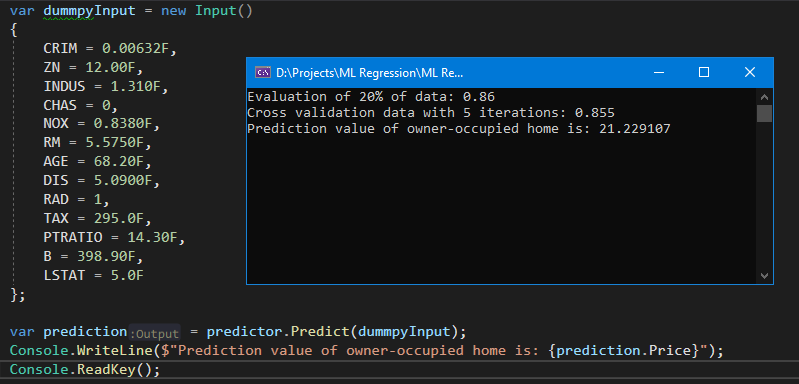

# ML.NET-Regression
ML.NET Regression Example which is applied to Boston's Housing Dataset.
The input columns are:
   * CRIM = Per capita crime rate by town
   * ZN = Proportion of residential land zoned for lots over 25,000 sq.ft
   * INDUS = The proportion of non-retail business acres per town
   * CHAS = Charles River dummy variable (= 1 if tract bounds river; 0 otherwise)
   * NOX = Nitric oxides concentration (parts per 10 million)
   * RM = The average number of rooms per dwelling
   * AGE = The proportion of owner-occupied units built before 1940
   * DIS = Weighted distances to five Boston employment centers
   * RAD = Index of accessibility to radial highways
   * TAX = Full-value property-tax rate per $10,000
   * PTRATIO = Pupil-teacher ratio by town
   * B = 1000(Bk - 0.63)^2 where Bk is the proportion of blacks by town
   * LSTAT = % lower status of the population
   * The output is the price in $1000's.
 
The whole training data is 80% of total inputs so the rest is used for the test data set.
A dummy prediction is done that is presented below.

  

